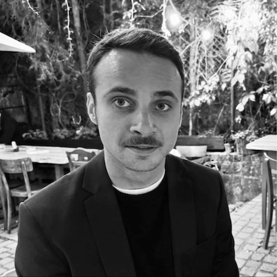

# Martin Urbánek

**Senior WordPress & WooCommerce Developer** · Brno (remote / hybrid)

---

📫 kontakt@martinurbanek.cz · +420 733 256 209 · https://martinurbanek.cz/portfolio

---

Stručně
-------
WordPress & WooCommerce vývojář s více než 10 lety praxe v návrhu, vývoji a provozu e‑commerce řešení. Specializuji se na custom pluginy, platební integrace a API propojení. Přináším systematický přístup k výkonu, testovatelnosti a bezpečnosti.

Co přináším
------------
- 10+ let zkušeností s WordPress/WooCommerce, autor komerčních pluginů pro český trh
- Silné zkušenosti s API (REST) a napojováním interních systémů
- Rozsáhlé zkušenosti s výkonnostní optimalizací (cache, CDN, dotazy)
- DevOps návyky: Docker, Bitbucket Pipelines, GitHub CI/CD, monitoring a stabilní nasazení
- Testování: Cypress (E2E), PHPUnit, static analysis (PHPStan), automatická refaktorizace (Rector)

Klíčové zkušenosti
------------------

### České kormidlo — WordPress Developer (2025)
- Vývoj custom pluginu s API integracemi pro cestovní kancelář
- Úpravy WooCommerce checkoutu a optimalizace UX

### MetaIT — WordPress Developer (2023–2024)
- Projekt Prague.eu: navrhl a připravil jsem REST API pro propojení s několika interními systémy
- Vývoj vlastních Gutenberg bloků a integrace s interními službami

### České pluginy — Founder & Developer (2020–současnost)
- Vývoj a distribuce pluginů: QR platby, Comgate, GoSMS, Fio bank API
- Návrh licenčního systému a provoz e‑shopu pro distribuci pluginů

### Freelance Web Developer (2014–současnost)
- Komplexní vývoj webů a e-shopů na míru (WordPress, WooCommerce, vlastní PHP řešení)
- Návrh architektury, custom pluginy, šablony, API integrace, optimalizace výkonu a bezpečnosti
- Správa serverů, DevOps (Docker, Bitbucket Pipelines, GitHub CI/CD), monitoring, automatizace nasazení
- Frontend (React, Vanilla JS, jQuery), moderní CSS (SASS, Bootstrap, Tailwind)
- Dlouhodobá údržba, importy/exporty dat, školení klientů, technické konzultace

Vybrané projekty
----------------
- Prague.eu — REST API integrace a výkonová optimalizace
- České pluginy — platební a bankovní integrace
- coworkscan.io — katalog (WordPress)
- mksnj.cz — multisite nasazení kulturního centra

Technický stack
---------------

- **Backend:** PHP 8+ (WordPress, Nette, Laravel)
- **Frontend:** JavaScript (React, Vue.js, Vanilla, jQuery), HTML5, CSS3 (SASS, Bootstrap, Tailwind)
- **DB:** MySQL / MariaDB / PostgreSQL
- **DevOps:** Docker, Linux, Bash, Git, CI/CD (Bitbucket Pipelines, GitHub)
- **Testing & QA:** Cypress, PHPUnit, PHPStan, PHP Rector
- **Nástroje:** Webpack, Gulp, NPM, Figma, Photoshop, Affinity Studio

Bezpečnost & škálovatelnost
--------------------------

- Ochrana proti SQL injection, XSS, CSRF; bezpečné nahrávání souborů
- Cache vrstvy, CDN, indexování a optimalizace dotazů
- Monitorování, logování a profilování (Xdebug, slow queries)

Vzdělání
--------

SPŠE Frenštát p. R. (2005) — Mechanik elektronických zařízení

Jazyky
------

- Čeština — rodilý mluvčí
- Angličtina — pokročilá (B2)

Doporučení pro zaměstnavatele
----------------------------

- Okamžitě převzetí technické odpovědnosti za WordPress/WooCommerce projekty
- Rychlé zavedení testovacího toolingu a CI postupů
- PrestaShop — základní praktické povědomí; rychlá adaptace a ochota převzít platformu

Kontakt
-------

- Portfolio: https://martinurbanek.cz/portfolio
- Email: kontakt@martinurbanek.cz — rád sjednám krátký technický hovor nebo ukázku kódu

---

Poznámka: lze rychle zkrátit na jednostránkovou verzi nebo upravit pro konkrétní pozici.